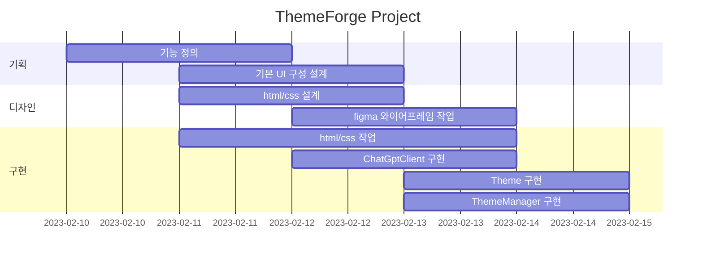

# themeforge

키워드-디자인 테마 생성기

- 목표
  - 키워드에서 테마 데이터를 추출하고, 적용해 봄으로써 ui 디자인에 도움을 주는 서비스

- 사용방법
  - 생성할 테마 개수를 입력해 주세요.
  - 키워드를 입력해 주세요.
  - 모든 옵션을 정상적으로 설정하였다면, 생성 버튼을 누르거나 엔터 키를 입력하세요.

- 서비스 URL
  - 실행 url : [https://Zeyakim.github.io/themeforge]

## WBS

## 설계

### 기술 스택

HTML, CSS, JavaScript

### 코딩 컨벤션

#### HTML

- tab size: 2
- tag: camelCase
- id: snake_case
- class: kebab-case

#### CSS

- tab size: 2
- property: snake_case

#### JavaScript

- tab size: 2
- class: PascalCase
- variable: camelCase
- function: camelCase

### 와이어프레임
  

