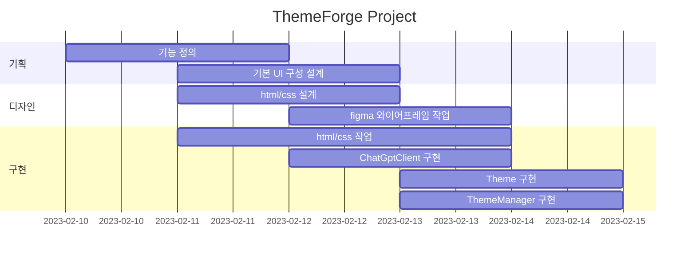
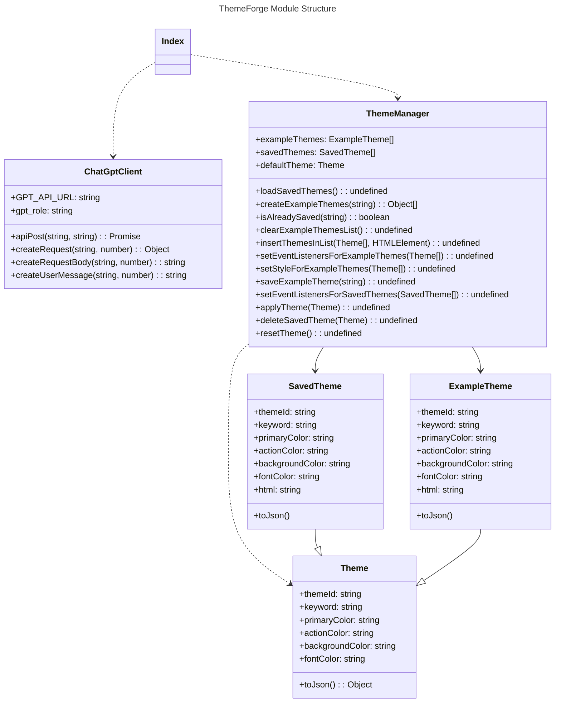
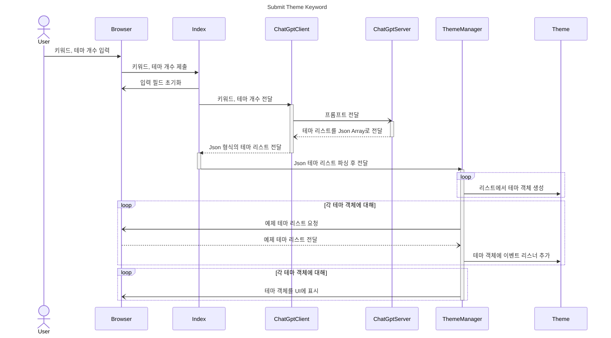
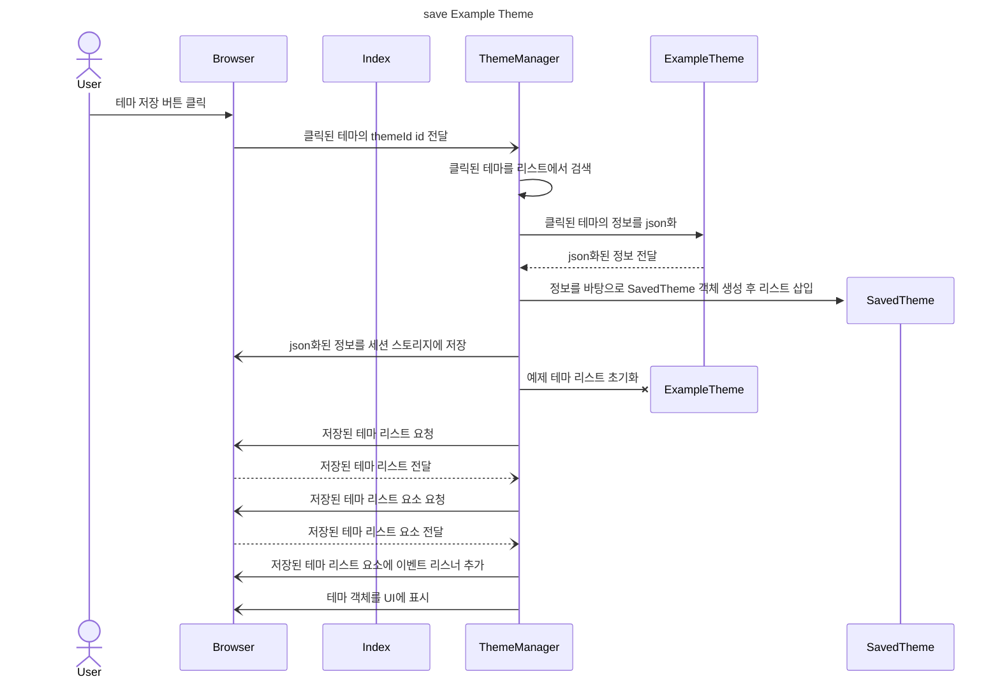

# ThemeForge

키워드-디자인 테마 생성기

- 목표
  - 키워드에서 테마 데이터를 추출하고 적용해볼 수 있는 페이지 제공 프로젝트

- 사용방법
  1. 키워드를 입력해 주세요.
  2. 생성할 테마 개수를 입력해 주세요.
  3. 모든 옵션을 정상적으로 설정하였다면, 생성 버튼을 누르거나 엔터 키를 입력하세요.

- 서비스 URL
  - 실행 url : [https://Zeyakim.github.io/themeforge](https://Zeyakim.github.io/themeforge)
  - github url : [https://github.com/ZeyaKim/themeforge](https://github.com/ZeyaKim/themeforge)

## 설계

### 기술 스택

HTML, CSS, JavaScript

### 코딩 컨벤션

#### HTML

- tab size: 2
- tag: camelCase
- id: snake_case
- class: kebab-case

#### CSS

- tab size: 2
- property: kebab-case

#### JavaScript

- tab size: 2
- class: PascalCase
- variable: camelCase
- function: camelCase

### WBS



### 와이어프레임

- figma로 초기 화면 구성을 디자인하였음. 와이어프레임을 하려다가 더 나가서 와이어프레임 대신 화면 디자인을 첨부하였음.


### 폴더 구조

```plaintext
📦themeforge
 ┣ 📂assets
 ┃ ┣ 📜banner.jpg
 ┃ ┗ 📜logo.jpg
 ┣ 📂docs
 ┃ ┣ 📜class diagram.md
 ┃ ┣ 📜sequence diagram.md
 ┃ ┗ 📜wbs.md
 ┣ 📂src
 ┃ ┣ 📜chatgpt_client.js
 ┃ ┣ 📜example_theme.js
 ┃ ┣ 📜saved_theme.js
 ┃ ┣ 📜theme.js
 ┃ ┗ 📜theme_manager.js
 ┣ 📜index.html
 ┣ 📜index.js
 ┣ 📜README.md
 ┗ 📜style.css
```

### 모듈 구조



### Sequence Diagram

#### 키워드 제출


#### 테마 저장



## 개발 히스토리

### 개발 동기

- 프로젝트 주제보다 디자인을 먼저 생각하고 있었는데, 어떤 컬러로 테마를 구성할까 고민하면서 ChatGPT에게 물어보았다. 그러다 키워드에서 컬러 테마를 추출하는 서비스를 만들어 보면 어떨까 생각하게 되었다.

### 트러블슈팅

- ChatGPT에게 Json Format Array로 데이터를 받아오기로 했는데, 가끔 답변이 json 형식이 아닌 경우가 있었다. 그래서 Shot 기법을 사용하여, 정상적인 답변의 예시를 첨부하니 해결되었다.

- css 변수, js 내 html/css, html id를 오가다 보니 네이밍 케이스를 제대로 식별하지 못하는 경우가 있었다. 그래서 네이밍 케이스를 통일하고, 변수명을 명확하게 지정하여 개발하였다.

## 참고

- [https://brunch.co.kr/@chulhochoiucj0/17](https://brunch.co.kr/@chulhochoiucj0/17)
  - 색상 설정에 대한 이론적인 지식을 많이 참고해서 프롬프트에 적용하였다.
