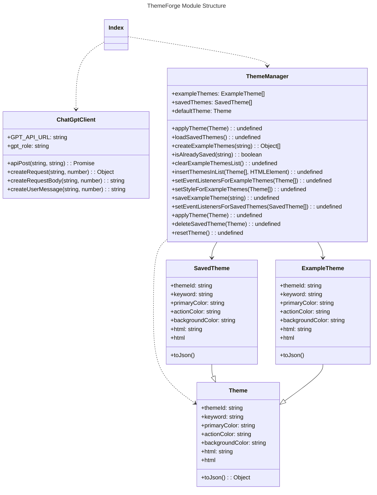

# 모듈 구조

```mermaid
---
title: ThemeForge Module Structure
---

classDiagram
    class Index {

    }

    class ChatGptClient {
        +GPT_API_URL: string
        +gpt_role: string
        +apiPost(string, string): Promise<string>
        +createRequest(string, number): Object
        +createRequestBody(string, number): string
        +createUserMessage(string, number): string
    }

    class ThemeManager {
        +exampleThemes: ExampleTheme[]
        +savedThemes: SavedTheme[]
        +defaultTheme: Theme
        +applyTheme(Theme): undefined
        +loadSavedThemes(): undefined
        +createExampleThemes(string): Object[]
        +isAlreadySaved(string): boolean
        +clearExampleThemesList(): undefined
        +insertThemesInList(Theme[], HTMLElement): undefined
        +setEventListenersForExampleThemes(Theme[]): undefined
        +setStyleForExampleThemes(Theme[]): undefined
        +saveExampleTheme(string): undefined
        +setEventListenersForSavedThemes(SavedTheme[]): undefined
        +applyTheme(Theme): undefined
        +deleteSavedTheme(Theme): undefined
        +resetTheme(): undefined
    }

    class Theme {
        +themeId: string
        +keyword: string
        +primaryColor: string
        +actionColor: string
        +backgroundColor: string
        +html: string
        +html
        +toJson(): Object
    }

    class ExampleTheme {
        +themeId: string
        +keyword: string
        +primaryColor: string
        +actionColor: string
        +backgroundColor: string
        +html: string
        +html
        +toJson()
    }

    class SavedTheme {
        +themeId: string
        +keyword: string
        +primaryColor: string
        +actionColor: string
        +backgroundColor: string
        +html: string
        +html
        +toJson()
    }

    Index ..> ChatGptClient
    Index ..> ThemeManager
    ThemeManager ..> Theme
    ThemeManager --> ExampleTheme
    ThemeManager --> SavedTheme
    SavedTheme --|> Theme
    ExampleTheme --|> Theme
```
