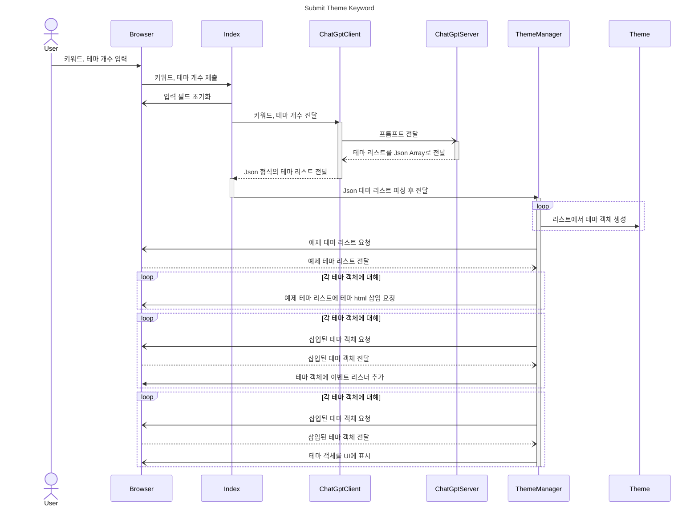
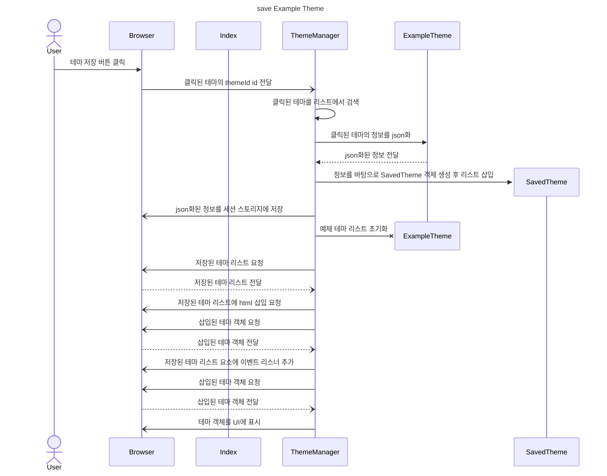

# Sequence Diagram

```mermaid
---
title: Submit Theme Keyword
---
sequenceDiagram
    actor User
    participant Browser
    participant Index
    participant ChatGptClient
    participant ChatGptServer
    participant ThemeManager

    User->>Browser: 키워드, 테마 개수 입력
    Browser->>Index: 키워드, 테마 개수 제출
    Index-)Browser: 입력 필드 초기화
    Index->>ChatGptClient: 키워드, 테마 개수 전달
    activate ChatGptClient
    ChatGptClient-)ChatGptServer: 프롬프트 전달
    activate ChatGptServer
    ChatGptServer--)ChatGptClient: 테마 리스트를 Json Array로 전달
    deactivate ChatGptServer
    ChatGptClient-->>Index: Json 형식의 테마 리스트 전달
    deactivate ChatGptClient
    activate Index
    Index->>ThemeManager: Json 테마 리스트 파싱 후 전달
    deactivate Index
    activate ThemeManager
    loop
        ThemeManager->>Theme: 리스트에서 테마 객체 생성
    end
    ThemeManager-)Browser: 예제 테마 리스트 요청
    Browser--)ThemeManager: 예제 테마 리스트 전달
    loop 각 테마 객체에 대해    
        ThemeManager-)Browser: 예제 테마 리스트에 테마 html 삽입 요청
    end
    loop 각 테마 객체에 대해
        ThemeManager-)Browser: 삽입된 테마 객체 요청
        Browser--)ThemeManager: 삽입된 테마 객체 전달
        ThemeManager->>Browser: 테마 객체에 이벤트 리스너 추가
    end
    loop 각 테마 객체에 대해
        ThemeManager-)Browser: 삽입된 테마 객체 요청
        Browser--)ThemeManager: 삽입된 테마 객체 전달
        ThemeManager-)Browser: 테마 객체를 UI에 표시
    end
    deactivate ThemeManager
```

```mermaid
---
title: save Example Theme
---
sequenceDiagram
    actor User
    participant Browser
    participant Index
    participant ThemeManager
    participant ExampleTheme

    User->>Browser: 테마 저장 버튼 클릭
    Browser-)ThemeManager: 클릭된 테마의 themeId id 전달
    ThemeManager->>ThemeManager: 클릭된 테마를 리스트에서 검색
    ThemeManager->>ExampleTheme: 클릭된 테마의 정보를 json화
    ExampleTheme-->>ThemeManager: json화된 정보 전달
    create participant SavedTheme
    ThemeManager->>SavedTheme: 정보를 바탕으로 SavedTheme 객체 생성 후 리스트 삽입
    ThemeManager-)Browser: json화된 정보를 세션 스토리지에 저장
    destroy ExampleTheme
    ThemeManager-xExampleTheme: 예제 테마 리스트 초기화
    ThemeManager-)Browser: 저장된 테마 리스트 요청
    Browser--)ThemeManager: 저장된 테마 리스트 전달
    ThemeManager-)Browser: 저장된 테마 리스트에 html 삽입 요청
    ThemeManager-)Browser: 삽입된 테마 객체 요청
    Browser--)ThemeManager: 삽입된 테마 객체 전달
    ThemeManager-)Browser: 저장된 테마 리스트 요소에 이벤트 리스너 추가
    ThemeManager-)Browser: 삽입된 테마 객체 요청
    Browser--)ThemeManager: 삽입된 테마 객체 전달
    ThemeManager-)Browser: 테마 객체를 UI에 표시 
```
